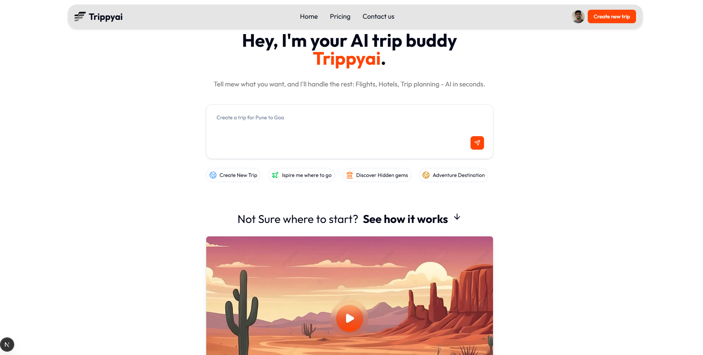

# ✈️ Trippy.ai - AI-Powered Trip Planner

**Trippy.ai** is a modern, interactive web application that leverages the power of Large Language Models (LLMs) to help users plan their dream vacations. Through a conversational chat interface, users can define their travel needs, and Trippy.ai will generate personalized itineraries, suggestions, and plans in real-time.

This project is built with a focus on modern web technologies, security, and a dynamic user experience, showcasing how Generative UI can create more engaging and intuitive applications.

## ✨ Features

- **Conversational Trip Planning:** Engage in a natural conversation with an AI agent to build your travel plans step-by-step.
- **Dynamic UI Generation:** The application's UI adapts based on the AI's questions, rendering specific components for budget, group size, travel interests, and more.
- **Secure User Authentication:** Full user management system including sign-up, sign-in, and profile management.
- **Protected API Endpoints:** Smart rate limiting to prevent abuse and ensure service availability.
- **Responsive Design:** Fully functional and beautiful on both desktop and mobile devices.

## 🚀 Tech Stack

- **Framework:** [Next.js](https://nextjs.org/) (React)
- **Styling:** [Tailwind CSS](https://tailwindcss.com/) & [shadcn/ui](https://ui.shadcn.com/)
- **Authentication:** [Clerk](https://clerk.com/)
- **AI / LLM:** [Google Gemini API](https://aistudio.google.com/)
- **API Security:** [Arcjet](https://arcjet.com/) (Rate Limiting)

---

## 🧠 Key Learnings & Architectural Highlights

This project was an opportunity to implement several cutting-edge web development concepts.

### 1. Rate Limiting with Arcjet

To protect our AI-powered API endpoint (`/api/aimodel`) from abuse, spam, or denial-of-service attacks, we implemented **Arcjet** for intelligent rate limiting.

- **Why Arcjet?** It provides a simple yet powerful way to secure Next.js applications. With just a few lines of code, it analyzes incoming requests and blocks malicious traffic before it hits our server function.
- **Implementation:** By wrapping our API route with the Arcjet client, we can enforce a token bucket algorithm that allows for bursts of traffic but maintains a steady average rate, ensuring fair usage and protecting our API from being overwhelmed. This is crucial for managing the costs and availability of the underlying LLM.

### 2. Authentication with Clerk

User management is handled seamlessly by **Clerk**. It provides a complete, pre-built solution for authentication and user profiles, allowing us to focus on the core features of the application.

- **Why Clerk?** It abstracts away the complexities of building a secure authentication system. Clerk provides beautiful, customizable UI components (`<SignInButton>`, `<UserButton>`) and powerful hooks (`useUser`) that integrate directly into our Next.js application.
- **Implementation:** We use Clerk to manage user sign-up and sign-in. Once a user is authenticated, we can access their information (like name, email, and profile image) anywhere in our application, creating a personalized experience. This also allows us to potentially save user-generated trips in the future.

### 3. Server-Side Generative UI

This is one of the most exciting aspects of Trippy.ai. Instead of having a static interface, the UI dynamically changes based on the conversation with the AI.

- **The Concept:** Our AI model doesn't just return text; it returns a JSON object containing both a conversational response (`resp`) and a `ui` token. This token is a command that tells the frontend which specific React component to render next.
- **Implementation:**
  1.  The user sends a message to the AI.
  2.  Our Next.js API route calls the Gemini API, instructing it to provide a response and a UI token (e.g., `'groupSize'`, `'budget'`, `'final'`).
  3.  The frontend receives this structured data.
  4.  A function in our `Chatbox` component acts as a router, checking the `ui` token and rendering the corresponding component (e.g., `<GroupSizeUi />`, `<BudgetUi />`).
  5.  This creates a "generative UI" where the AI literally builds the user's interface step-by-step, making the interaction feel much more intelligent and guided.

---

## 🛠️ Getting Started

Follow these instructions to get a local copy up and running.

### Prerequisites

- Node.js (v18 or later)
- npm, yarn, or pnpm

### Installation

1.  **Clone the repository:**

    ```bash
    git clone [https://github.com/your-username/trippy.ai.git](https://github.com/your-username/trippy.ai.git)
    cd trippy.ai
    ```

2.  **Install dependencies:**

    ```bash
    npm install
    ```

3.  **Set up environment variables:**

    - Create a new file named `.env.local` in the root of your project.
    - Copy the contents of `.env.local.example` into it and fill in the required API keys.

4.  **Run the development server:**
    ```bash
    npm run dev
    ```

## 📸 Screenshots

<p align="center">
  <em>Hero Section</em><br>
  
</p>
<p align="center">
  <em>Popular Destinations</em><br>
  
</p>
<p align="center">
  <em>Chat Interface</em><br>
  
</p>
